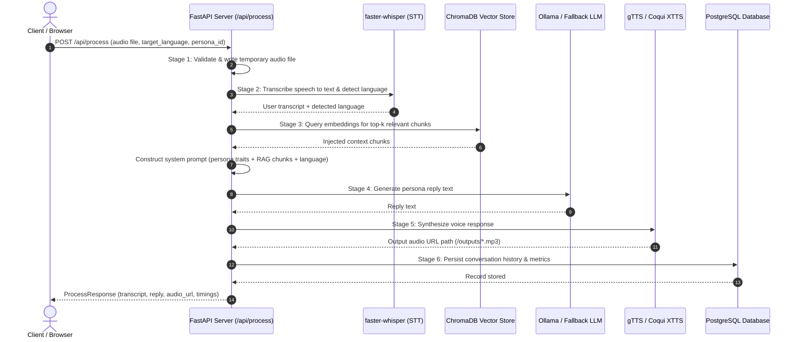

# Resonant API Reference

Resonant is an AI Digital Twin platform for multilingual personal presence. It allows users to build, query, and interact with personalized digital personas using an end-to-end multimodal pipeline: Speech-to-Text (STT) $\rightarrow$ Retrieval-Augmented Generation (RAG) $\rightarrow$ Large Language Model (LLM) $\rightarrow$ Text-to-Speech (TTS).

---

## Table of Contents

- [Overview & Base URL](#overview--base-url)
- [Pipeline Architecture](#pipeline-architecture)
- [Authentication & Headers](#authentication--headers)
- [Error Handling & Status Codes](#error-handling--status-codes)
- [API Endpoints Summary](#api-endpoints-summary)
- [System & Health Endpoints](#system--health-endpoints)
  - [1. GET /api/health](#1-get-apihealth)
- [Core Pipeline Endpoints](#core-pipeline-endpoints)
  - [2. POST /api/process](#2-post-apiprocess)
- [Persona Management Endpoints](#persona-management-endpoints)
  - [3. GET /api/personas](#3-get-apipersonas)
  - [4. POST /api/personas](#4-post-apipersonas)
  - [5. GET /api/personas/{id}](#5-get-apipersonasid)
  - [6. PUT /api/personas/{id}](#6-put-apipersonasid)
  - [7. DELETE /api/personas/{id}](#7-delete-apipersonasid)
- [Conversation History Endpoints](#conversation-history-endpoints)
  - [8. GET /api/personas/{id}/history](#8-get-apipersonasidhistory)
  - [9. DELETE /api/conversations/{id}](#9-delete-apiconversationsid)
- [Knowledge & RAG Management Endpoints](#knowledge--rag-management-endpoints)
  - [10. POST /api/personas/{id}/knowledge](#10-post-apipersonasidknowledge)
  - [11. GET /api/personas/{id}/knowledge](#11-get-apipersonasidknowledge)
  - [12. DELETE /api/personas/{id}/knowledge](#12-delete-apipersonasidknowledge)
- [Data Models & Schemas](#data-models--schemas)
- [End-to-End Workflow Tutorial](#end-to-end-workflow-tutorial)

---

## Overview & Base URL

The default local development server runs at:

```
http://localhost:8000
```

### Interactive Documentation

FastAPI provides automated interactive API documentation:
- **Swagger UI**: `http://localhost:8000/docs`
- **ReDoc**: `http://localhost:8000/redoc`

### Static Media Serving

Generated audio files are saved in the configured output directory and served under the `/outputs/` static mount:

```
http://localhost:8000/outputs/{audio_filename}
```

---

## Pipeline Architecture

The primary endpoint `POST /api/process` executes a sequential 6-stage multimodal pipeline:



---

## Authentication & Headers

Currently, authentication is not enforced in the development environment. Standard headers apply:

| Header | Value | Description |
|---|---|---|
| `Accept` | `application/json` | Required for all JSON endpoints |
| `Content-Type` | `application/json` | Required when sending JSON request bodies |
| `Content-Type` | `multipart/form-data` | Required for file upload endpoints (`/process`, `/knowledge`) |

CORS is configured to accept requests from all origins (`*`) during local development.

---

## Error Handling & Status Codes

All errors return JSON payloads adhering to the following schema:

```json
{
  "detail": "Descriptive human-readable error message"
}
```

Alternatively, structured error responses follow:

```json
{
  "error": "validation_failed",
  "detail": "Recording too short. Please speak for at least 1-2 seconds.",
  "status_code": 400
}
```

### Standard Status Codes

| Code | Status | Meaning |
|---|---|---|
| `200` | OK | Request succeeded. Body contains requested data. |
| `201` | Created | Resource successfully created. |
| `204` | No Content | Action completed successfully (e.g. DELETE). No response body. |
| `400` | Bad Request | Invalid input parameters, audio file too short, or unreadable document. |
| `404` | Not Found | Target persona, conversation, or document ID does not exist. |
| `422` | Unprocessable Entity | Pydantic validation failure on request payload fields. |
| `500` | Internal Server Error | Unhandled server or AI pipeline failure. |

---

## API Endpoints Summary

| # | Method | Path | Summary | Success Status |
|---|---|---|---|---|
| 1 | `GET` | `/api/health` | Server health check and AI backend status | `200 OK` |
| 2 | `POST` | `/api/process` | Main voice-to-voice pipeline execution | `200 OK` |
| 3 | `GET` | `/api/personas` | List all digital twin personas | `200 OK` |
| 4 | `POST` | `/api/personas` | Create a new persona profile | `201 Created` |
| 5 | `GET` | `/api/personas/{id}` | Retrieve a specific persona by ID | `200 OK` |
| 6 | `PUT` | `/api/personas/{id}` | Update an existing persona profile | `200 OK` |
| 7 | `DELETE` | `/api/personas/{id}` | Delete a persona and cascading records | `204 No Content` |
| 8 | `GET` | `/api/personas/{id}/history` | Get conversation history for a persona | `200 OK` |
| 9 | `DELETE` | `/api/conversations/{id}` | Delete an individual conversation entry | `204 No Content` |
| 10 | `POST` | `/api/personas/{id}/knowledge` | Upload and ingest a knowledge document | `201 Created` |
| 11 | `GET` | `/api/personas/{id}/knowledge` | List ingested knowledge documents | `200 OK` |
| 12 | `DELETE` | `/api/personas/{id}/knowledge` | Delete all knowledge documents for persona | `200 OK` |

---

## System & Health Endpoints

### 1. GET /api/health

Verifies server health, displays version information, and reports the runtime status of all AI subsystem dependencies (STT model, LLM connection, and TTS engine).

- **Method**: `GET`
- **Path**: `/api/health`
- **Request Headers**: `Accept: application/json`
- **Parameters**: None

#### Response (200 OK — Healthy)

```json
{
  "status": "healthy",
  "version": "0.1.0",
  "services": {
    "stt": "loaded",
    "llm": "available",
    "tts": "ready"
  }
}
```

#### Response (200 OK — Degraded / Fallback Mode)

When the remote or local LLM server (e.g., Ollama or Colab tunnel) is offline, the status becomes `degraded` and the system switches to template fallback responses:

```json
{
  "status": "degraded",
  "version": "0.1.0",
  "services": {
    "stt": "faster-whisper (base)",
    "llm": "fallback",
    "tts": "gtts"
  }
}
```

#### cURL Examples

**Bash:**
```bash
curl -X GET "http://localhost:8000/api/health" \
  -H "Accept: application/json"
```

**PowerShell:**
```powershell
Invoke-RestMethod -Uri "http://localhost:8000/api/health" -Method Get
```

---

## Core Pipeline Endpoints

### 2. POST /api/process

The core multimodal pipeline endpoint of Resonant. Accepts an audio recording of the user speaking, performs speech recognition via Whisper, searches persona-specific vector knowledge via ChromaDB, prompts the LLM to respond in character, converts the response to audio via TTS, logs the interaction to the database, and returns the full result.

- **Method**: `POST`
- **Path**: `/api/process`
- **Content-Type**: `multipart/form-data`

#### Request Parameters (Multipart Form)

| Field | Type | Required | Default | Description |
|---|---|---|---|---|
| `audio` | File | **Yes** | — | Recorded speech file (`.wav`, `.mp3`, `.webm`, `.ogg`). Minimum size 500 bytes. |
| `target_language` | String | No | `"en"` | Language code for response (`en`, `hi`, `es`, `fr`, `de`, `zh`, or `auto`). |
| `persona_id` | Integer | No | `1` | ID of the persona digital twin to interact with. |

#### Response (200 OK)

```json
{
  "transcript": "Could you explain how gradient descent works in simple terms?",
  "reply_text": "Imagine you are hiking down a foggy mountain. You cannot see the bottom, but you can feel which direction slopes downward under your feet. Gradient descent takes small steps in the steepest downward direction until reaching the valley floor.",
  "audio_url": "/outputs/response_20260923_7f8a9b1c.mp3",
  "target_language": "en",
  "context_used": [
    "Gradient descent is a first-order iterative optimization algorithm for finding a local minimum of a differentiable function.",
    "The learning rate determines the size of the steps taken towards the minimum."
  ],
  "processing_time_ms": 1342.85
}
```

#### Error Responses

- **`400 Bad Request`**: Audio file too small, missing, or no intelligible speech detected.
  ```json
  {
    "detail": "Recording too short. Please hold the record button for at least 1-2 seconds while speaking."
  }
  ```
- **`404 Not Found`**: Specified `persona_id` does not exist.
  ```json
  {
    "detail": "Persona with id 99 not found. Create one first via the UI or POST /api/personas."
  }
  ```
- **`500 Internal Server Error`**: Pipeline failure in STT, RAG, LLM, or TTS stages.
  ```json
  {
    "error": "pipeline_failed",
    "detail": "An unexpected error occurred during processing. Please try again.",
    "status_code": 500
  }
  ```

#### cURL Examples

**Bash:**
```bash
curl -X POST "http://localhost:8000/api/process" \
  -F "audio=@sample_question.wav;type=audio/wav" \
  -F "target_language=en" \
  -F "persona_id=1"
```

**PowerShell:**
```powershell
$form = @{
    audio = Get-Item -Path "sample_question.wav"
    target_language = "en"
    persona_id = "1"
}
Invoke-RestMethod -Uri "http://localhost:8000/api/process" -Method Post -Form $form
```

---

## Persona Management Endpoints

### 3. GET /api/personas

Lists all registered digital twin personas in the system.

- **Method**: `GET`
- **Path**: `/api/personas`
- **Request Headers**: `Accept: application/json`
- **Parameters**: None

#### Response (200 OK)

```json
[
  {
    "id": 1,
    "name": "Dr. Ayesha Sharma",
    "role": "Professor of Computer Science",
    "institution": "IIT Delhi",
    "personality_traits": [
      "Patient",
      "Uses intuitive analogies",
      "Humorous",
      "Encouraging"
    ],
    "knowledge_areas": [
      "Deep Learning",
      "Distributed Systems",
      "Natural Language Processing"
    ],
    "speaking_style": "Conversational, academic yet approachable, avoids unnecessary jargon",
    "constraints": [
      "Never claim to be conscious or human",
      "Keep answers under 150 words",
      "Politely decline non-academic queries"
    ],
    "voice_sample_path": "outputs/voices/dr_ayesha.wav",
    "created_at": "2026-09-01T08:30:00Z",
    "updated_at": "2026-09-15T12:00:00Z"
  }
]
```

#### cURL Examples

**Bash:**
```bash
curl -X GET "http://localhost:8000/api/personas" \
  -H "Accept: application/json"
```

**PowerShell:**
```powershell
Invoke-RestMethod -Uri "http://localhost:8000/api/personas" -Method Get
```

---

### 4. POST /api/personas

Creates a new digital twin persona with specific personality traits, expertise domains, speaking style, behavioral constraints, and optional voice sample path.

- **Method**: `POST`
- **Path**: `/api/personas`
- **Content-Type**: `application/json`

#### Request Body Schema

| Field | Type | Required | Description |
|---|---|---|---|
| `name` | String | **Yes** | Persona name (1-100 characters). |
| `role` | String | No | Professional title or position (e.g. "Dean of Engineering"). |
| `institution` | String | No | Affiliated university or company. |
| `personality_traits` | Array of Strings | No | Character traits (default: `[]`). |
| `knowledge_areas` | Array of Strings | No | Specialized subject domains (default: `[]`). |
| `speaking_style` | String | No | Tone, pacing, and vocabulary instructions. |
| `constraints` | Array of Strings | No | Strict rules the persona must follow (default: `[]`). |
| `voice_sample_path` | String | No | Path to voice sample for audio cloning. |

#### Request Body Example

```json
{
  "name": "Dr. Marcus Vance",
  "role": "Associate Professor of AI Ethics",
  "institution": "Stanford University",
  "personality_traits": [
    "Analytical",
    "Thoughtful",
    "Socratic",
    "Objective"
  ],
  "knowledge_areas": [
    "AI Governance",
    "Algorithmic Bias",
    "Machine Ethics"
  ],
  "speaking_style": "Measured, reflective, poses thought-provoking questions",
  "constraints": [
    "Do not provide binding legal counsel",
    "Keep replies concise and focused"
  ],
  "voice_sample_path": "outputs/voices/marcus_sample.wav"
}
```

#### Response (201 Created)

```json
{
  "id": 2,
  "name": "Dr. Marcus Vance",
  "role": "Associate Professor of AI Ethics",
  "institution": "Stanford University",
  "personality_traits": [
    "Analytical",
    "Thoughtful",
    "Socratic",
    "Objective"
  ],
  "knowledge_areas": [
    "AI Governance",
    "Algorithmic Bias",
    "Machine Ethics"
  ],
  "speaking_style": "Measured, reflective, poses thought-provoking questions",
  "constraints": [
    "Do not provide binding legal counsel",
    "Keep replies concise and focused"
  ],
  "voice_sample_path": "outputs/voices/marcus_sample.wav",
  "created_at": "2026-09-23T18:10:00.000000Z",
  "updated_at": "2026-09-23T18:10:00.000000Z"
}
```

#### Error Responses

- **`422 Unprocessable Entity`**: Validation failed (e.g. missing `name`).
  ```json
  {
    "detail": [
      {
        "type": "missing",
        "loc": ["body", "name"],
        "msg": "Field required"
      }
    ]
  }
  ```

#### cURL Examples

**Bash:**
```bash
curl -X POST "http://localhost:8000/api/personas" \
  -H "Content-Type: application/json" \
  -d '{
    "name": "Dr. Marcus Vance",
    "role": "Associate Professor of AI Ethics",
    "institution": "Stanford University",
    "personality_traits": ["Analytical", "Thoughtful"],
    "knowledge_areas": ["AI Governance", "Ethics"],
    "speaking_style": "Measured and reflective",
    "constraints": ["Do not provide legal counsel"],
    "voice_sample_path": "outputs/voices/marcus_sample.wav"
  }'
```

**PowerShell:**
```powershell
$body = @{
    name = "Dr. Marcus Vance"
    role = "Associate Professor of AI Ethics"
    institution = "Stanford University"
    personality_traits = @("Analytical", "Thoughtful")
    knowledge_areas = @("AI Governance", "Ethics")
    speaking_style = "Measured and reflective"
    constraints = @("Do not provide legal counsel")
    voice_sample_path = "outputs/voices/marcus_sample.wav"
} | ConvertTo-Json

Invoke-RestMethod -Uri "http://localhost:8000/api/personas" `
  -Method Post `
  -ContentType "application/json" `
  -Body $body
```

---

### 5. GET /api/personas/{id}

Retrieves full details for a single persona by its unique integer identifier.

- **Method**: `GET`
- **Path**: `/api/personas/{id}`
- **Path Parameter**: `id` (Integer, required) — Persona ID.

#### Response (200 OK)

```json
{
  "id": 1,
  "name": "Dr. Ayesha Sharma",
  "role": "Professor of Computer Science",
  "institution": "IIT Delhi",
  "personality_traits": [
    "Patient",
    "Uses intuitive analogies",
    "Humorous"
  ],
  "knowledge_areas": [
    "Deep Learning",
    "Distributed Systems"
  ],
  "speaking_style": "Conversational, academic yet approachable",
  "constraints": [
    "Never claim to be conscious or human",
    "Keep answers under 150 words"
  ],
  "voice_sample_path": "outputs/voices/dr_ayesha.wav",
  "created_at": "2026-09-01T08:30:00Z",
  "updated_at": "2026-09-15T12:00:00Z"
}
```

#### Error Responses

- **`404 Not Found`**: Persona with specified ID does not exist.
  ```json
  {
    "detail": "Persona 99 not found"
  }
  ```

#### cURL Examples

**Bash:**
```bash
curl -X GET "http://localhost:8000/api/personas/1" \
  -H "Accept: application/json"
```

**PowerShell:**
```powershell
Invoke-RestMethod -Uri "http://localhost:8000/api/personas/1" -Method Get
```

---

### 6. PUT /api/personas/{id}

Updates an existing persona's profile. Only fields included in the request body are modified; unspecified fields remain untouched.

- **Method**: `PUT`
- **Path**: `/api/personas/{id}`
- **Path Parameter**: `id` (Integer, required) — Persona ID.
- **Content-Type**: `application/json`

#### Request Body Schema (All Fields Optional)

| Field | Type | Description |
|---|---|---|
| `name` | String | Updated name. |
| `role` | String | Updated role. |
| `institution` | String | Updated institution. |
| `personality_traits` | Array of Strings | Updated personality traits. |
| `knowledge_areas` | Array of Strings | Updated knowledge areas. |
| `speaking_style` | String | Updated speaking style. |
| `constraints` | Array of Strings | Updated constraints. |
| `voice_sample_path` | String | Updated voice sample file path. |

#### Request Body Example

```json
{
  "speaking_style": "Warm, highly engaging, uses everyday analogies",
  "constraints": [
    "Never claim to be human",
    "Limit responses to 100 words",
    "Encourage the student to attempt problem solving"
  ]
}
```

#### Response (200 OK)

```json
{
  "id": 1,
  "name": "Dr. Ayesha Sharma",
  "role": "Professor of Computer Science",
  "institution": "IIT Delhi",
  "personality_traits": [
    "Patient",
    "Uses intuitive analogies",
    "Humorous"
  ],
  "knowledge_areas": [
    "Deep Learning",
    "Distributed Systems"
  ],
  "speaking_style": "Warm, highly engaging, uses everyday analogies",
  "constraints": [
    "Never claim to be human",
    "Limit responses to 100 words",
    "Encourage the student to attempt problem solving"
  ],
  "voice_sample_path": "outputs/voices/dr_ayesha.wav",
  "created_at": "2026-09-01T08:30:00Z",
  "updated_at": "2026-09-23T18:12:00.000000Z"
}
```

#### Error Responses

- **`404 Not Found`**: Persona with ID does not exist.
  ```json
  {
    "detail": "Persona 99 not found"
  }
  ```

#### cURL Examples

**Bash:**
```bash
curl -X PUT "http://localhost:8000/api/personas/1" \
  -H "Content-Type: application/json" \
  -d '{
    "speaking_style": "Warm, highly engaging, uses everyday analogies",
    "constraints": ["Never claim to be human", "Limit responses to 100 words"]
  }'
```

**PowerShell:**
```powershell
$body = @{
    speaking_style = "Warm, highly engaging, uses everyday analogies"
    constraints = @("Never claim to be human", "Limit responses to 100 words")
} | ConvertTo-Json

Invoke-RestMethod -Uri "http://localhost:8000/api/personas/1" `
  -Method Put `
  -ContentType "application/json" `
  -Body $body
```

---

### 7. DELETE /api/personas/{id}

Deletes a persona profile. Cascades to delete all associated conversation history in PostgreSQL and all ingested RAG documents in PostgreSQL and ChromaDB.

- **Method**: `DELETE`
- **Path**: `/api/personas/{id}`
- **Path Parameter**: `id` (Integer, required) — Persona ID.

#### Response (204 No Content)

Empty response body.

#### Error Responses

- **`404 Not Found`**: Persona with ID does not exist.
  ```json
  {
    "detail": "Persona 99 not found"
  }
  ```

#### cURL Examples

**Bash:**
```bash
curl -X DELETE "http://localhost:8000/api/personas/2" -i
```

**PowerShell:**
```powershell
Invoke-RestMethod -Uri "http://localhost:8000/api/personas/2" -Method Delete
```

---

## Conversation History Endpoints

### 8. GET /api/personas/{id}/history

Retrieves past conversation logs for a specific persona, sorted by timestamp descending (most recent interactions first).

- **Method**: `GET`
- **Path**: `/api/personas/{id}/history`
- **Path Parameter**: `id` (Integer, required) — Persona ID.
- **Query Parameter**:
  - `limit` (Integer, optional, default: `50`, maximum: `200`): Maximum number of conversation records to retrieve.

#### Response (200 OK)

```json
[
  {
    "id": 14,
    "persona_id": 1,
    "transcript": "What is the difference between supervised and unsupervised learning?",
    "target_language": "en",
    "reply_text": "In supervised learning, we give the model input data along with correct answers or labels. In unsupervised learning, the model only receives unlabeled data and must discover hidden patterns on its own.",
    "reply_audio_path": "/outputs/response_20260920_e3f2a1b9.mp3",
    "processing_time_ms": 1150.4,
    "created_at": "2026-09-20T14:22:15.123456Z"
  },
  {
    "id": 13,
    "persona_id": 1,
    "transcript": "Kya aap mujhe transformer models samjha sakte hain?",
    "target_language": "hi",
    "reply_text": "Transformer models self-attention mechanism ka upyog karte hain taaki sentence ke saare words ko ek saath process kiya ja sake.",
    "reply_audio_path": "/outputs/response_20260920_a7b8c9d0.mp3",
    "processing_time_ms": 1420.1,
    "created_at": "2026-09-20T14:18:02.789012Z"
  }
]
```

#### Error Responses

- **`404 Not Found`**: Persona ID does not exist.
  ```json
  {
    "detail": "Persona 99 not found"
  }
  ```

#### cURL Examples

**Bash:**
```bash
curl -X GET "http://localhost:8000/api/personas/1/history?limit=20" \
  -H "Accept: application/json"
```

**PowerShell:**
```powershell
Invoke-RestMethod -Uri "http://localhost:8000/api/personas/1/history?limit=20" -Method Get
```

---

### 9. DELETE /api/conversations/{id}

Deletes an individual conversation log from the database.

- **Method**: `DELETE`
- **Path**: `/api/conversations/{id}`
- **Path Parameter**: `id` (Integer, required) — Conversation ID.

#### Response (204 No Content)

Empty response body.

#### Error Responses

- **`404 Not Found`**: Conversation ID does not exist.
  ```json
  {
    "detail": "Conversation 14 not found"
  }
  ```

#### cURL Examples

**Bash:**
```bash
curl -X DELETE "http://localhost:8000/api/conversations/14" -i
```

**PowerShell:**
```powershell
Invoke-RestMethod -Uri "http://localhost:8000/api/conversations/14" -Method Delete
```

---

## Knowledge & RAG Management Endpoints

### 10. POST /api/personas/{id}/knowledge

Uploads a plain text document (lecture notes, research papers, syllabus, FAQ) to enrich the persona's knowledge base. The document is chunked, converted into semantic vector embeddings using `sentence-transformers`, stored in ChromaDB, and indexed in PostgreSQL.

- **Method**: `POST`
- **Path**: `/api/personas/{id}/knowledge`
- **Path Parameter**: `id` (Integer, required) — Persona ID.
- **Content-Type**: `multipart/form-data`

#### Request Parameters (Multipart Form)

| Field | Type | Required | Description |
|---|---|---|---|
| `document` | File | **Yes** | Plain text file (`.txt`), UTF-8 encoded. |
| `title` | String | No | Document title. If omitted, extracted from filename. |

#### Response (201 Created)

```json
{
  "id": 8,
  "title": "CS401 Distributed Systems Syllabus & FAQ",
  "persona_id": 1,
  "chunk_count": 12,
  "total_chars": 9480,
  "message": "Document 'CS401 Distributed Systems Syllabus & FAQ' ingested successfully with 12 chunks."
}
```

> **Note**: The returned `id` field corresponds to the unique `document_id` generated in PostgreSQL.

#### Error Responses

- **`400 Bad Request`**: File is empty or not valid UTF-8 text.
  ```json
  {
    "detail": "Could not decode file. Please upload a UTF-8 text file (.txt)."
  }
  ```
- **`404 Not Found`**: Persona with ID does not exist.
  ```json
  {
    "detail": "Persona 99 not found"
  }
  ```

#### cURL Examples

**Bash:**
```bash
curl -X POST "http://localhost:8000/api/personas/1/knowledge" \
  -F "document=@cs401_syllabus.txt;type=text/plain" \
  -F "title=CS401 Distributed Systems Syllabus & FAQ"
```

**PowerShell:**
```powershell
$form = @{
    document = Get-Item -Path "cs401_syllabus.txt"
    title = "CS401 Distributed Systems Syllabus & FAQ"
}
Invoke-RestMethod -Uri "http://localhost:8000/api/personas/1/knowledge" -Method Post -Form $form
```

---

### 11. GET /api/personas/{id}/knowledge

Lists all knowledge documents that have been ingested into the persona's RAG knowledge store.

- **Method**: `GET`
- **Path**: `/api/personas/{id}/knowledge`
- **Path Parameter**: `id` (Integer, required) — Persona ID.

#### Response (200 OK)

```json
{
  "persona_id": 1,
  "persona_name": "Dr. Ayesha Sharma",
  "documents": [
    {
      "id": 8,
      "title": "CS401 Distributed Systems Syllabus & FAQ",
      "doc_type": "txt",
      "chunk_count": 12,
      "created_at": "2026-09-23T10:15:30Z"
    },
    {
      "id": 9,
      "title": "Lecture 1: Paxos and Raft Consensus",
      "doc_type": "txt",
      "chunk_count": 18,
      "created_at": "2026-09-23T11:45:00Z"
    }
  ],
  "total_documents": 2,
  "total_chunks": 30
}
```

#### Error Responses

- **`404 Not Found`**: Persona with ID does not exist.
  ```json
  {
    "detail": "Persona 99 not found"
  }
  ```

#### cURL Examples

**Bash:**
```bash
curl -X GET "http://localhost:8000/api/personas/1/knowledge" \
  -H "Accept: application/json"
```

**PowerShell:**
```powershell
Invoke-RestMethod -Uri "http://localhost:8000/api/personas/1/knowledge" -Method Get
```

---

### 12. DELETE /api/personas/{id}/knowledge

Deletes all ingested knowledge documents for a persona from both the PostgreSQL metadata database and the ChromaDB vector database.

- **Method**: `DELETE`
- **Path**: `/api/personas/{id}/knowledge`
- **Path Parameter**: `id` (Integer, required) — Persona ID.

#### Response (200 OK)

```json
{
  "message": "Deleted 2 documents (30 chunks) for persona 1",
  "documents_deleted": 2,
  "chunks_deleted": 30
}
```

#### Error Responses

- **`404 Not Found`**: Persona with ID does not exist.
  ```json
  {
    "detail": "Persona 99 not found"
  }
  ```

#### cURL Examples

**Bash:**
```bash
curl -X DELETE "http://localhost:8000/api/personas/1/knowledge" \
  -H "Accept: application/json"
```

**PowerShell:**
```powershell
Invoke-RestMethod -Uri "http://localhost:8000/api/personas/1/knowledge" -Method Delete
```

---

## Data Models & Schemas

### Persona Object

```typescript
interface Persona {
  id: number;
  name: string;
  role: string | null;
  institution: string | null;
  personality_traits: string[];
  knowledge_areas: string[];
  speaking_style: string | null;
  constraints: string[];
  voice_sample_path: string | null;
  created_at?: string; // ISO 8601 UTC
  updated_at?: string; // ISO 8601 UTC
}
```

### ProcessResponse Object

```typescript
interface ProcessResponse {
  transcript: string;
  reply_text: string;
  audio_url: string;
  target_language: string;
  context_used: string[];
  processing_time_ms: number;
}
```

### Conversation Object

```typescript
interface Conversation {
  id: number;
  persona_id: number;
  transcript: string;
  target_language: string;
  reply_text: string;
  reply_audio_path: string | null;
  processing_time_ms: number | null;
  created_at: string; // ISO 8601 UTC
}
```

### KnowledgeDoc Object

```typescript
interface KnowledgeDoc {
  id: number;
  title: string;
  doc_type: string;
  chunk_count: number;
  created_at: string; // ISO 8601 UTC
}
```

### HealthResponse Object

```typescript
interface HealthResponse {
  status: "healthy" | "degraded" | "unhealthy";
  version: string;
  services: {
    stt: string; // e.g. "faster-whisper (base)"
    llm: string; // e.g. "ollama (http://localhost:11434) - ONLINE"
    tts: string; // e.g. "gtts"
  };
}
```

---

## End-to-End Workflow Tutorial

Below is a complete command-line walkthrough showing how to initialize a persona, upload knowledge documents, run the AI pipeline, inspect history, and clean up.

### Step 1: Check Server Health

```bash
curl -s http://localhost:8000/api/health | jq
```

### Step 2: Create a New Persona

```bash
curl -s -X POST http://localhost:8000/api/personas \
  -H "Content-Type: application/json" \
  -d '{
    "name": "Prof. Alan Turing",
    "role": "Computer Scientist & Cryptanalyst",
    "institution": "University of Manchester",
    "personality_traits": ["Curious", "Mathematical", "Direct"],
    "knowledge_areas": ["Turing Machines", "Computability", "Cryptanalysis"],
    "speaking_style": "Analytical and concise",
    "constraints": ["Keep answers under 100 words"]
  }' | jq
```

*Note the returned `id` (e.g., `2`).*

### Step 3: Upload Knowledge Document for the Persona

```bash
# Create sample knowledge document
cat <<EOF > computability.txt
The Halting Problem is a decision problem in computability theory.
Alan Turing proved in 1936 that a general algorithm to solve the
halting problem for all possible program-input pairs cannot exist.
EOF

# Ingest document into persona #2
curl -s -X POST http://localhost:8000/api/personas/2/knowledge \
  -F "document=@computability.txt" \
  -F "title=Computability and the Halting Problem" | jq
```

### Step 4: List Persona Knowledge

```bash
curl -s http://localhost:8000/api/personas/2/knowledge | jq
```

### Step 5: Execute Voice Pipeline (Process Audio)

```bash
curl -s -X POST http://localhost:8000/api/process \
  -F "audio=@user_question.wav" \
  -F "target_language=en" \
  -F "persona_id=2" | jq
```

### Step 6: Review Conversation History

```bash
curl -s "http://localhost:8000/api/personas/2/history?limit=20" | jq
```

### Step 7: Delete Individual Conversation

```bash
curl -s -X DELETE http://localhost:8000/api/conversations/1 -i
```

### Step 8: Delete Knowledge Documents

```bash
curl -s -X DELETE http://localhost:8000/api/personas/2/knowledge | jq
```

### Step 9: Delete Persona

```bash
curl -s -X DELETE http://localhost:8000/api/personas/2 -i
```
